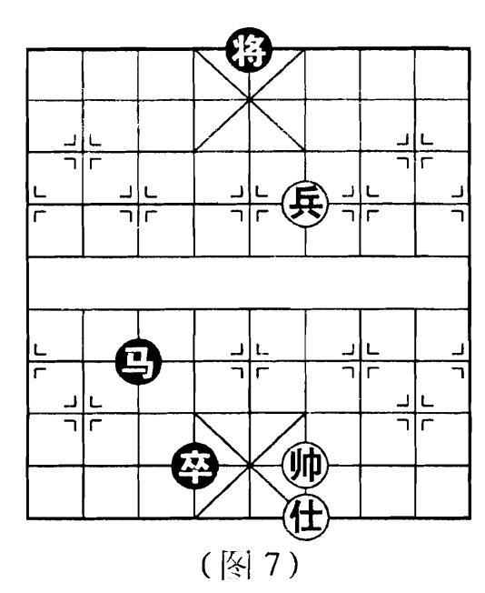
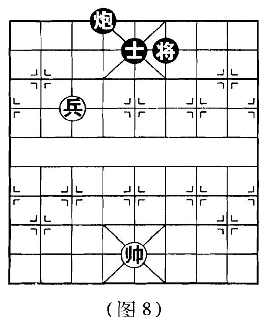

## 例 3

如(图7),黑方是低卒,威 力减弱。并且红仕在帅底使黑 方无法攻击, 是兵与仕唯一的 守和马卒方法。

①

②

③ 则 四 讲 一 图 7 进 8

④ 如四退一 (和棋)

## 例 4

如(图8),见于古谱《适情 雅趣》, 题名"雨不得济"。因 红兵可以控制黑将, 使其无法 抢夺中路而守和。

① 医七平六

图4平5

② 卿 五平六

❸6讲1

③帅六退一

₩6平5

④ 多六平五

**3**5平6

⑤ 医 五平六

🔞 5 平 4

⑥卿六平五 (和棋)

例 5

单兵与仕或相配合, 更可以获得一些例和局, (图 9) 即是一 则典型例局。

① 第二平三 4 平 5 ② 他 五 进 四 4 7 6

③他四退五03进5

① **每**三平二**9**5平6 **⑤ 每**二平三**8**6平5 **⑥ 他**五进四**9**5进3